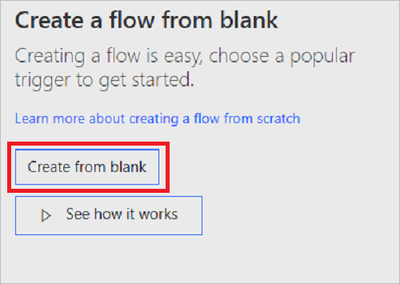
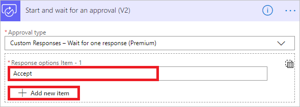
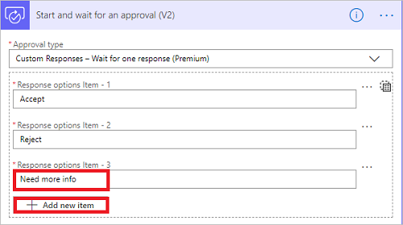
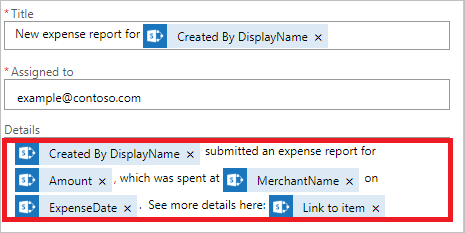

## Create custom response options for approval flows

Let’s say we want to send an approval request each time an employee uploads an expense report to SharePoint and then allow the approver to respond with one of three options: Accept, Need more info, or Reject.

## Prerequisites

- An Microsoft Flow account with a Plan 2 license (Plan 2 is needed to use premium features. Approvals is a premium feature.)
- A SharePoint list for employees to enter their expense reports.

## Create approval flow
1. Sign into [Microsoft Flow](Https://flow.microsoft.com).
1. Select **My flows** from the navigation bar on the left side.
1. Select **New**, and then **Create from blank**.

    
1. Select **Create from blank**. 

    

1. Search for **sharepoint**, and then select **When an item is created** from the list of triggers. 

1. Provide the SharePoint **Site Address** and **List Name**. 

1. Select **New step**, search for **Approval**, and then select **Start and wait for an approval (V2)**.

1. Select the **Approval type** list on the **Start and wait for an approval (V2)** card.

    

1. Select **Custom Responses - Wait for one response (Premium)**.

    

    Next, you will create the custom responses that your approvers will use when they respond to an approval request for an employee expense.

1. Enter **Accept** into the **Response options Item - 1** box. 

    

1. Select **Add new item**, and then enter **Reject** into the **Response options Item - 2** box

    

1. Select **Add new item**, and then enter **Need more info** into the **Response options Item - 3** box

    

1. Enter a **Title**, **Assigned to**, (email for the approver), and **Details** (the details to be contained in the approval request).

    Here's an example of what you might include for your organization.

    

## Use approval responses 

Now that you've created your custom responses, you might want to do different things in your flow, depending on the response from the approver.

For instance, if the response to the request is **Accept**, you might want to send an email to the Accounting department, asking them to reimburse the employee for the expense. 

If the response is **Reject**, you want to send an email to the employee, letting them know that the request was rejected.

And finally, if the response from the approver is **Need more info**, you might want to send an email to the employee, requesting that the employee provides more information.

To do any of these in the flow, add a [**Condition**](add-condition.md) or a **Switch** action to your flow, and then select the **Outcome** field of the approval request from the dynamic content picker. Be sure to confirm whether the value is Accept, Need more info, or Reject.

## Respond to approval requests with a custom response

Approvers receive approval requests in email. The requests are also displayed in the approval center on Microsoft Flow. 

## Learn more
- Create [single approver flows](modern-approvals.md)
- Create [sequential approver flows](sequential-modern-approvals.md)
