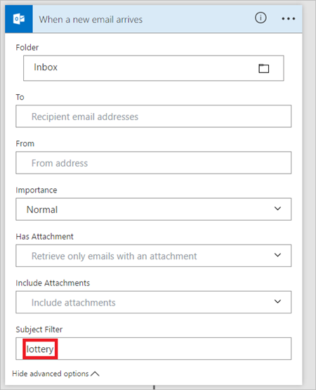
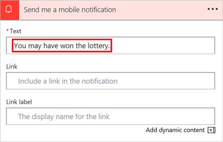
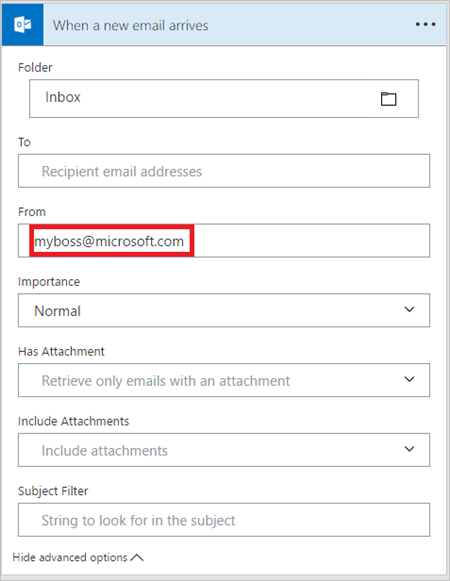
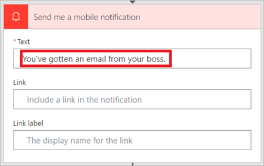
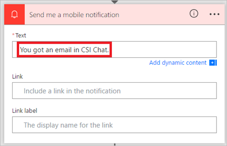

# Trigger a flow based on email properties
Use the **When a new email arrives** trigger to create a flow that runs when one or more of the following email properties match criteria that you provide:

| Property | When to use |
| --- | --- |
| Folder |Trigger a flow whenever emails arrive in a specific folder. This property can be useful if you have rules that route emails to different folders. |
| To |Trigger a flow based on the address to which an email was sent. This property can be useful if you receive email that was sent to different email addresses in the same inbox. |
| From |Trigger a flow based on the sender's email address. |
| Importance |Trigger a flow based on the importance with which emails were sent. Email can be sent with high, normal, or low importance. |
| Has Attachment |Trigger a flow based on the presence of attachments on incoming emails. |
| Subject Filter |Search for the presence of specific words in the subject of an email. Your flow then runs *actions* that are based on the results of your search. |

> [!IMPORTANT]
> Each [Microsoft Flow plan](https://flow.microsoft.com/pricing/) includes a run quota. Always check properties in the flow's trigger when possible. Doing so avoids using your run quota unnecessarily. If you check a property in a condition, each run counts against your plan's run quota, even if the filter condition that you defined isn't met. 

For example, if you check an email's *from* address in a condition, each run counts against your plan's run quota, even if it's not *from* the address that interests you.
> 
> 

In the following walkthroughs, we check all properties in the **When a new email arrives** trigger. Learn more by visiting the [frequently asked billing questions](billing-questions.md#what-counts-as-a-run) and the [pricing](https://ms.flow.microsoft.com/pricing/) page.

## Prerequisites
* An account with access to [Microsoft Flow](https://flow.microsoft.com)
* An Office 365 Outlook account
* The Microsoft Flow mobile app for [Android](https://aka.ms/flowmobiledocsandroid), [iOS](https://aka.ms/flowmobiledocsios), or [Windows Phone](https://aka.ms/flowmobilewindows)
* Connections to Office, Outlook, and the push notification service

## Trigger a flow based on an email's subject
In this walkthrough, we create a flow that sends a push notification to your mobile phone if the subject of any new email has the word "lottery" in it. Your flow then marks any such email as *read*.

>[!NOTE]
>While this walkthrough sends a push notification, you're free to use any other action that suits your workflow needs. For example, you could store the email contents in another repository such as Google Sheets or a Microsoft Excel file stored on Dropbox.

Ok, let's get started:

[!INCLUDE [sign-in-use-blank-select-email-trigger-and-inbox-folder](includes/sign-in-use-blank-select-email-trigger-and-inbox-folder.md)]

1. In the **Subject Filter** box, enter the text that your flow uses to filter incoming emails.
   
     In this example, we're interested in any email that has the word "lottery" in the subject.
   
    

[!INCLUDE [add-mobile-notification-action](includes/add-mobile-notification-action.md)]

1. Enter the details for the mobile notification you want to receive when you receive an email that matches the **Subject Filter** you specified earlier.
   
    

[!INCLUDE [add-mark-as-read-action](includes/add-mark-as-read-action.md)]

1. Give your flow a name. Then save it by selecting **Create flow** at the top of the page.
   
    

Congratulations! You now receive a push notification each time you receive an email that contains the word "lottery" in the subject.

## Trigger a flow based on an email's sender
In this walkthrough, we create a flow that sends a push notification to your mobile phone if any new email arrives from a specific sender (email address). The flow also marks any such email as *read*.

[!INCLUDE [sign-in-use-blank-select-email-trigger-and-inbox-folder](includes/sign-in-use-blank-select-email-trigger-and-inbox-folder.md)]

1. Enter the email address of the sender in the **From** box.
   
     Your flow takes action on any emails that are sent from this address.
   
    

[!INCLUDE [add-mobile-notification-action](includes/add-mobile-notification-action.md)]

1. Enter the details for the mobile notification you'd like to receive whenever a message arrives from the email address that you entered earlier.
   
    

    [!INCLUDE [add-mark-as-read-action](includes/add-mark-as-read-action.md)]

1. Give your flow a name, and then save it by selecting **Create flow** at the top of the page.
   
    

## Trigger a flow when emails arrive in a specific folder
If you have rules that route email to different folders based on certain properties, such as the address, you may want this type of flow.

Let's get started:

> [!NOTE]
> If you don't already have a rule that routes email to a folder other than your inbox, create such a rule and confirm it works by sending a test email.
> 
> 

[!INCLUDE [sign-in-use-blank-select-email-trigger-and-specific-folder](includes/sign-in-use-blank-select-email-trigger-and-specific-folder.md)]

1. Select the folder to which you've created the rule to route specific emails. To display all email folders, first select the **Show Picker** icon, which is located on the right side of the **Folder** box on the **When a new email arrives** card.
   
    

[!INCLUDE [add-mobile-notification-action](includes/add-mobile-notification-action.md)]

1. Enter the details for the mobile notification you'd like to receive when an email arrives into the folder you selected earlier. If you haven't already, enter the credentials for the notifications service.
   
    

[!INCLUDE [add-mark-as-read-action](includes/add-mark-as-read-action.md)]

1. Give your flow a name, and then save it by selecting **Create flow** at the top of the page.
   
    

Test the flow by sending an email that gets routed to the folder you selected earlier in this walkthrough.

