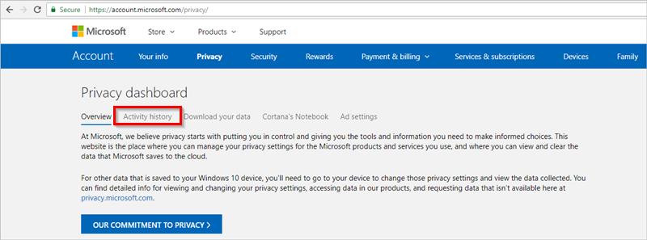
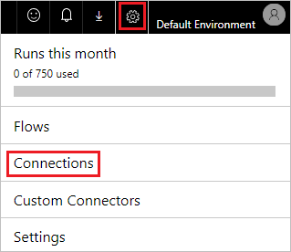

# Respond to GDPR Data Subject Delete Requests
[!INCLUDE [view-pending-approvals](includes/cc-rebrand.md)]

The **right to erasure** by the removal of personal data is a key protection in the GDPR. Removing personal data includes removing all personal data except audit log information.

Microsoft Flow allows users to build automated workflows. When a user decides to delete their personal data from Microsoft Flow, the user can review their personal data, and determine whether to delete some or all of it.

The following table shows which personal data is automatically deleted and which data requires a Microsoft Account (MSA) user to review and delete it.

|Requires the MSA user to review and delete|Automatically deleted|
|------|------|
|Product and service activity|Run history|
|Flows|Activity Feed|
|Connections||

Microsoft Flow offers the following experiences to help users find, review, or change personal data and resources that aren't automatically deleted:

## Manage Delete requests

The steps below describe how to self-serve delete requests for GDPR.

### Delete Product and service activity

1. Sign into the [Microsoft Privacy Dashboard](https://account.microsoft.com/privacy/) with your MSA.
1. Select the **Activity history** link.

    

1. You can search or browse your activity history for the different Microsoft applications and services that you use, including Microsoft Flow. Select **Delete** to remove specific product or service activity events.

    

1. Within a few moments, the item is deleted and removed from privacy dashboard.

### List and delete flows

A user can list and delete their flows from [Power Automate](https://flow.microsoft.com) by follwing these steps:

1. Sign into the [Power Automate](https://flow.microsoft.com), and then select on **My flows**.

1. Select **...** beside the flow that you're deleting, and then select **Delete**.

    

### Delete Connections

Connectors use connections to communicate with APIs and SaaS systems. Connections include references to the user who creates them. The user can delete these references at any time by follwing these steps:

1. Sign into [Power Automate](https://flow.microsoft.com), select the gear icon, and then select **Connections**.

    

1. Select the connection that you'd like to delete, select **...**, and then select **Delete**.

    

1. Select the **Delete** icon on the confirmation prompt.

    

> [!NOTE]
> If other flows use the connection, you're deleting, you're notified that a new connection is required. Otherwise, select **Delete** to continue.
>
>

## Learn more

* Get started with [Power Automate](getting-started.md)
* Learn [what's new](release-notes.md) with Microsoft Flow
