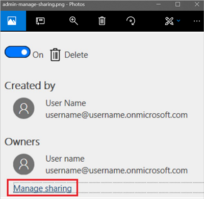
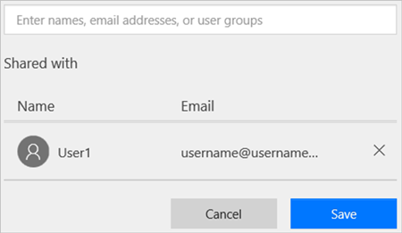
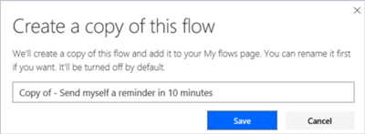

# Responding to GDPR Data Subject Delete Requests for Microsoft Flow

## Introduction
The “right to erasure” by the removal of personal data from an organization’s Customer Data is a key protection in the GDPR. Removing personal data includes removing all personal data and system-generated logs, except audit log information.
Microsoft Flow allows users to build automation workflows that are a critical part of your organization’s day-to-day operations, so when a user leaves your organization you will need to manually review and determine whether or not to delete certain data and resources that they have created.   here is other customer data that will be automatically deleted whenever the user’s account deleted from Azure Active Directory. 
Here is the breakdown between which customer data will be automatically deleted and which data will require your manual review and deletion:

|Requires manual review and deletion|Automatically deleted when the user is deleted from Azure Active Directory|
|------|------|
|Environment*|System-generated logs|
|Environment permissions**|Run history|
|Flows|User jobs|
|Flow permissions|Gateway *|
|User details|Gateway permissions |
|Connections*||
|Connection permissions||
|Custom connector*||
|Custom connector permissions||

* Each of these resources contain “Created By” and “Modified By” records that include personal data. For security reasons, these records will be retained until the resource is deleted.
** For environments that include a Common Data Service For Apps database, environment permissions (e.g. which users are assigned to the Environment Maker and Admin roles?) stored as records in the Common Data Service database. Please see [Executing DSRs against Common Data Service Customer Data](https://go.microsoft.com/fwlink/?linkid=872251), for guidance on how to respond to DSRs for users that use the Common Data Service.

For the data and resources that requires manual review, Microsoft Flow offers the following experiences to find or change personal data for a specific user:

* **Website access:** sign in to the [PowerApps Admin Center](https://admin.powerapps.com/), or the [Microsoft Flow Admin Center](https://admin.flow.microsoft.com/)

* **PowerShell access:**  [PowerApps Admin PowerShell cdmlets](https://go.microsoft.com/fwlink/?linkid=871804) 

Here is the breakdown of which experiences are available for an admin to delete each types of customer data:

|System-generated logs|Website access|PowerShell access|Automated Deletion|
|-----|----|----|----|
|System-generated logs|[Office 365 Service Trust Portal](https://servicetrust.microsoft.com/)|||
|Environment|Microsoft Flow Admin Center|PowerApps cmdlets||
|Environment permissions*|Microsoft Flow Admin Center|PowerApps cmdlets||
|Run history||| Deleted through 28 day retention policy|
|Activity feed |||Deleted through 28 day retention policy|
|User jobs||Coming soon||
|Flows|Microsoft Flow Maker Portal**|||
|Flow permissions|Microsoft Flow Maker Portal**|||
|User details||PowerApps cmdlets||
|Connections|Microsoft Flow Maker Portal**|Coming soon||
|Connection permissions|Microsoft Flow Maker Portal**|Coming soon||
|Custom connector|Microsoft Flow Maker Portal**|Coming soon||
|Custom connector permissions|Microsoft Flow Maker Portal**|Coming soon||

* With the introduction of the Common Data Service for Apps, if a database is created within the environment, environment permissions and model-driven app permissions are stored as records within the Common Data Service for Apps database instance. Please see [Executing DSRs against Common Data Service Customer Data](https://go.microsoft.com/fwlink/?linkid=872251), for guidance on how to respond to DSRs for users that use the Common Data Service.
** An admin will only be able to access these resources from the Microsoft Flow Maker Portal if the administrator has assigned themselves access from the Microsoft Flow Admin Center.  

## Manage Delete requests
The steps below describe how administrative functions exist to serve delete requests for GDPR.

Important: To avoid data corruption, follow these steps in order.

**System-generated logs**

System-generated logs can be deleted from the [Office 365 Service Trust Portal](https://servicetrust.microsoft.com/). The tenant admin is the only person within your organization who can access system-generated logs associated with a particular user’s use of Microsoft Flow. The data retrieved for an access request will be provided in a machine-readable format and will be provided in files that will allow the user to know which services the data is associated with. As noted above, the data retrieved will not include data that may compromise the security of the service.

**List and re-assign flows** 

These steps copy existing flows for a departing user. If you assign new ownership to the copies, these flows can continue to support existing business processes. Copying these flows is important because new connections must be established for the flow to connect with other APIs and SaaS applications.

1. Sign in to the [Microsoft Flow admin center](https://admin.flow.microsoft.com/), and then select the environment that contains flows that the deleted user owns.

1. Select **Resources**, select **Flows**, and then select the title for the flow that you want to reassign.

1. Select **Manage sharing**.
 

1. In the **Share** panel that appears near the right edge, add yourself as an owner, and then select **Save**.

1. Sign in to the [Microsoft Flow site](https://flow.microsoft.com/), select **My flows**, and then select **Team flows**. 

1. Select the ellipsis **(… )** for the flow you want to copy, and then select **Save As**. 

1. Configure connections as required, and then select **Continue**.

1. Provide a new name, and then select **Save**.

1. This new version of the flow appears in **My flows**, where you can share it with additional users if you want.

1.	Delete the original flow by selecting the ellipsis **(…)** for it, selecting **Delete**, and then select **Delete** again when prompted. This step will also remove underlying system dependencies between the user and Microsoft Flow.

1. Enable the copy of the flow, by opening **My flows** and then turning the toggle control to **On**.
 

 1. The copy will now perform the same workflow logic as the original version.

**Delete approval history from Microsoft Flow**

 Approval data for Microsoft Flow is stored within the current or previous version of Common Data Service for Apps. Within an approval, personal information exists in the form of approval assignments and comments included in an approval response. Administrators can access that data by following these steps:
 
 1. Sign in to the [PowerApps site](https://web.powerapps.com/).

 1. Select **Data**, and then select **Entities**.

 1. Select the ellipsis **(…)** for the **Flow Approval** entity, and then open the data in Microsoft Excel.

1. In Microsoft Excel, search, filter and delete approval data as required.

Please see [Executing DSRs against Common Data Service Customer Data](https://go.microsoft.com/fwlink/?linkid=872251), for additional guidance on how to respond to DSRs for users that use the Common Data Service.

**Delete user details from Microsoft Flow**

Once all re-assignment and delete actions have been performed, there is a final step to delete remaining system data. This system data includes references to a user’s organization id (OID). This action is accomplished by calling a PowerShell cmdlet which will be available soon.  
