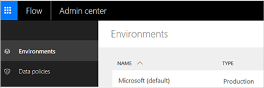

# Responding to GDPR Data Subject Delete Requests for Microsoft Flow

## Introduction

As part of our commitment to partner with you on your journey to the GDPR, we’ve developed  documentation to help you prepare. The documentation not only describes what we’re doing to prepare for the GDPR but also shares examples of steps you can take today with Microsoft to support GDPR compliance when using  Microsoft Flow.

## Manage delete requests
The steps below describe how administrative functions exist to serve delete requests for GDPR.

## Prerequisites
You can perform the administrative operations that this document outlines if you sign in to the [PowerApps Admin Center](https://admin.powerapps.com/), sign in to the [Microsoft Flow Admin Center](https://admin.flow.microsoft.com/), or run [PowerApps Admin PowerShell cdmlets](https://go.microsoft.com/fwlink/?linkid=871804) with an account that has these permissions:
*	A paid or trial license for Flow/PowerApps Plan 2.
If you [sign up for a trial license](http://web.powerapps.com/trial), it will expire after 30 days.

*	[Office 365 Global Administrator](https://support.office.com/article/assign-admin-roles-in-office-365-for-business-eac4d046-1afd-4f1a-85fc-8219c79e1504) or [Azure Active Directory Global Administrator](https://docs.microsoft.com/azure/active-directory/active-directory-assign-admin-roles-azure-portal).

**List and re-assign flows** 

These steps copy existing flows for a departing user. If you assign new ownership to the copies, these flows can continue to support existing business processes. Copying these flows is important because new connections must be established for the flow to connect with other APIs and SaaS applications.

1. Sign in to the [Microsoft Flow admin center](https://admin.flow.microsoft.com/), and then select the environment that contains flows that the deleted user owns.

1. Select **Resources**, select **Flows**, and then select the title for the flow that you want to reassign.

1. Select **Manage sharing**.
 

1. In the **Share** panel that appears near the right edge, add yourself as an owner, and then select **Save**.

1. Sign in to the [Microsoft Flow site](https://flow.microsoft.com/), select **My flows**, and then select **Team flows**. 

1. Select the ellipsis **(… )** for the flow you want to copy, and then select **Save As**. 

1. Configure connections as required, and then select **Continue**.

1. Provide a new name, and then select **Save**.

1. This new version of the flow appears in **My flows**, where you can share it with additional users if you want.

1.	Delete the original flow by selecting the ellipsis **(…)** for it, selecting **Delete**, and then select **Delete** again when prompted. This step will also remove underlying system dependencies between the user and Microsoft Flow.

1. Enable the copy of the flow, by opening **My flows** and then turning the toggle control to **On**.
 

 1. The copy will now perform the same workflow logic as the original version.

**Delete approval history from Microsoft Flow**

 Approval data for Microsoft Flow is stored within the current or previous version of Common Data Service for Apps. Within an approval, personal information exists in the form of approval assignments and comments included in an approval response. Administrators can access that data by following these steps:
 
 1. Sign in to the [PowerApps site](https://web.powerapps.com/).

 1. Select **Data**, and then select **Entities**.

 1. Select the ellipsis **(…)** for the **Flow Approval** entity, and then open the data in Microsoft Excel.

1. In Microsoft Excel, search, filter and delete approval data as required.

Please see [Executing DSRs against Common Data Service Customer Data](https://go.microsoft.com/fwlink/?linkid=872251), for additional guidance on how to respond to DSRs for users that use the Common Data Service.

**Delete user details from Microsoft Flow**

Once all re-assignment and delete actions have been performed, there is a final step to delete remaining system data. This action is accomplished by calling a Powershell cmdlet which will be available soon. Automation
