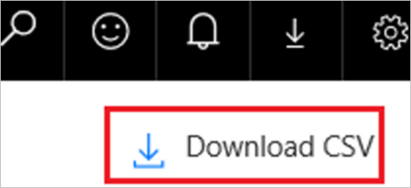
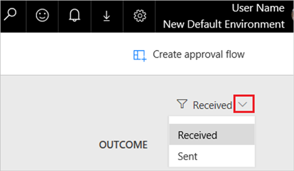

# Responding to GDPR Data Subject Export Requests for Microsoft Flow

## Introduction

As part of our commitment to partner with you on your journey to the GDPR, we’ve developed  documentation to help you prepare. The documentation not only describes what we’re doing to prepare for the GDPR but also shares examples of steps you can take today with Microsoft to support GDPR compliance when using  Microsoft Flow.

## Manage export requests
The steps below describe how both user and administrative functions exist to serve export requests for GDPR.

## Prerequisites
You can perform the administrative operations that this document outlines if you sign in to the [PowerApps Admin Center](https://admin.powerapps.com/), sign in to the [Microsoft Flow Admin Center](https://admin.flow.microsoft.com/), or run [PowerApps Admin PowerShell cdmlets](https://go.microsoft.com/fwlink/?linkid=871804) with an account that has these permissions:
*	A paid or trial license for Flow/PowerApps Plan 2.
If you [sign up for a trial license](http://web.powerapps.com/trial), it will expire after 30 days.

*	[Office 365 Global Administrator](https://support.office.com/article/assign-admin-roles-in-office-365-for-business-eac4d046-1afd-4f1a-85fc-8219c79e1504) or [Azure Active Directory Global Administrator](https://docs.microsoft.com/azure/active-directory/active-directory-assign-admin-roles-azure-portal).

**Export a flow** 

Either an end user or an administrator can export a flow by following these steps:
1. Sign in to the [Microsoft Flow site](https://flow.microsoft.com/).
1. Select the **My flows** link, and then select the flow to export.
1. Select **… More**, and then select **Export**.

1. Select **Package (.zip)**.

Your flow will now be available as a zipped package. For more information, see the blog post about [how to export and import a flow](https://flow.microsoft.com/en-us/blog/import-export-bap-packages/).

**Export run history** 

Run history includes a list of all executions that have occurred for a specific flow. This data includes the flow’s status, start time, duration, and input/output data for triggers and actions.

Either an end user or an administrator can export this data by following these steps:

1.	Sign in to the [Microsoft Flow site](https://flow.microsoft.com/).
1.	Select the **My flows** link, and then select the flow for which you wan to export the run history.
1.	In the **Run History** pane, select **See all**.

1.  Select **Download CSV**.

The run history is downloaded as a .csv file so that you can open it in Microsoft Excel or a text editor and further analyze the results.

**Export a user's activity feed** 

On the [Microsoft Flow site](https://flow.microsoft.com/), the activity feed shows a user’s history of activities, failures and notifications. Any user can view their activity feed by: 
1. Signing in to the [Microsoft Flow site](http://flow.microsoft.com/), selecting the bell icon near the upper-right corner, and then selecting **Show all activity**. 

1. In the **Activity** screen, users can copy the results and then paste them into a document editor, such as Microsoft Word.

**Export a list of a user’s connections**

Connections allow flows to connect to APIs, SaaS applications, and other third-party systems. Any user can view their connections by:
1. Signing in to the [Microsoft Flow site](http://flow.microsoft.com/), selecting the gear icon near the upper-right corner, and then selecting **Connections**.

1. Users can copy the results and then paste them into a document editor, such as Microsoft Word.

**Export approval history**

Microsoft Flow Approvals History captures a historical record of approvals that have been received or sent for a user. Any user can view their approval history by:
1. Signing in to the [Microsoft Flow site](http://flow.microsoft.com/), selecting **Approvals**, and then selecting **History**.

1. A list shows approvals that the user received. The users can show approvals that they sent by selecting the down arrow next to **Received** and then selecting **Sent**.

