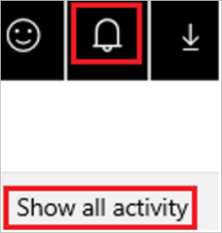
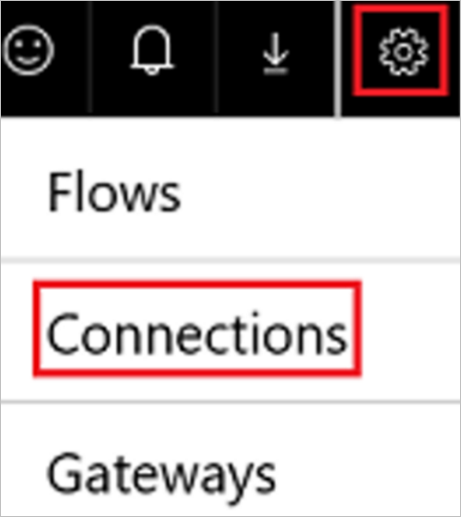

# Responding to GDPR Data Subject Export Requests for Microsoft Flow

## Introduction

As part of our commitment to partner with you on your journey to the GDPR, we’ve developed  documentation to help you prepare. The documentation not only describes what we’re doing to prepare for the GDPR but also shares examples of steps you can take today with Microsoft to support GDPR compliance when using  Microsoft Flow.

## Manage export requests
The “right of data portability” allows a data subject to request a copy of their personal data in an electronic format (that’s a “structured, commonly used, machine read-able and interoperable format”) that may be transmitted to another data controller. 

Microsoft Flow offers the following experiences to find or export personal data for a specific user:

* **Website access:** sign in to the [PowerApps Admin Center](https://admin.powerapps.com/), or the [Microsoft Flow Admin Center](https://admin.flow.microsoft.com/)

* **PowerShell access:**  [PowerApps Admin PowerShell cdmlets](https://go.microsoft.com/fwlink/?linkid=871804) 

|**Customer data**|**Website access**|**PowerShell access**|
|-----------------|------------------|-------------------|
|System-generated logs|[Office 365 Service Trust Portal](https://servicetrust.microsoft.com/)|
|Run history|Microsoft Flow Maker Portal||
|User jobs||Coming soon|
|Flows|Microsoft Flow Maker Portal||
|Flow permissions| Microsoft Flow Maker Portal and Microsoft Flow Admin Center||
|User details||Coming soon|
|Connections|Microsoft Flow Maker Portal|Coming soon|
|Connection permissions|Microsoft Flow Maker Portal|Coming soon|
|Custom connectors|Microsoft Flow Maker Portal|Coming soon|
|Custom connector permissions|Microsoft Flow Maker Portal|Coming soon|
|Gateway|Microsoft Flow Maker Portal|On-premise gateway PowerShell cmdlets|
|Gateway permissions|Microsoft Flow Maker Portal|

**Export a flow** 

Either an end user or an administrator, who has granted themselves access to the flow through the Microsoft Flow Admin Center,  can export a flow by following these steps:
1. Sign in to the [Microsoft Flow site](https://flow.microsoft.com/).
1. Select the **My flows** link, and then select the flow to export.
1. Select **… More**, and then select **Export**.

1. Select **Package (.zip)**.

Your flow will now be available as a zipped package. For more information, see the blog post about [how to export and import a flow](https://flow.microsoft.com/en-us/blog/import-export-bap-packages/).

**Export run history** 

Run history includes a list of all executions that have occurred for a specific flow. This data includes the flow’s status, start time, duration, and input/output data for triggers and actions.

Either an end user or an administrator, who has granted themselves access to the flow through the Microsoft Flow Admin Center, can export this data by following these steps:

1.	Sign in to the [Microsoft Flow site](https://flow.microsoft.com/).
1.	Select the **My flows** link, and then select the flow for which you wan to export the run history.
1.	In the **Run History** pane, select **See all**.

1.  Select **Download CSV**.

The run history is downloaded as a .csv file so that you can open it in Microsoft Excel or a text editor and further analyze the results.

**Export a user's activity feed** 

On the [Microsoft Flow site](https://flow.microsoft.com/), the activity feed shows a user’s history of activities, failures and notifications. Any user can view their activity feed by: 
1. Signing in to the [Microsoft Flow site](http://flow.microsoft.com/), selecting the bell icon near the upper-right corner, and then selecting **Show all activity**. 

1. In the **Activity** screen, users can copy the results and then paste them into a document editor, such as Microsoft Word.

**Export a list of a user’s connections**

Connections allow flows to connect to APIs, SaaS applications, and other third-party systems. Any user can view their connections by:
1. Signing in to the [Microsoft Flow site](http://flow.microsoft.com/), selecting the gear icon near the upper-right corner, and then selecting **Connections**.

1. Users can copy the results and then paste them into a document editor, such as Microsoft Word.

**Export a list of a user’s connection permissions**

A user can export the connection role assignments for all connection that they have access to via the Get-ConnectionRoleAssignment function in the PowerApps PowerShell cdmlets:

**Export a list of a user’s Custom connectors**
Custom Connectors supplement the existing out of box connectors and allow for connectivity to other APIs, SaaS and custom-developed systems. Custom Connector ownership may need to be transferred to other users in the organization or the Custom Connector can be deleted. To export a list of customer connectors, a user should:

1. Navigate to the [Microsoft Flow website](https://flow.microsoft.com).
1. Click on the settings **gear** icon.
1. Click on **Custom Connectors**.
1. Copy and paste the list of custom connectors into a text editor, such as Microsoft Word.

In addition to the experience provided in the Microsoft Flow website, a Powershell cmdlets is also available to export all custom connectors they have created to via the Get-Connector function in the PowerApps PowerShell cdmlets:

**Export a list of a user’s Custom connector permissions**
A user can export all custom connector permissions they have created to via the Get-ConnectorRoleAssignment function in the PowerApps PowerShell cdmlets:

**Export approval history**

Microsoft Flow Approvals History captures a historical record of approvals that have been received or sent for a user. Any user can view their approval history by:
1. Signing in to the [Microsoft Flow site](http://flow.microsoft.com/), selecting **Approvals**, and then selecting **History**.

1. A list shows approvals that the user received. The users can show approvals that they sent by selecting the down arrow next to **Received** and then selecting **Sent**.

**Export user details from Microsoft Flow**

User details can be exported by calling a Powershell cmdlet which will be available soon. 

