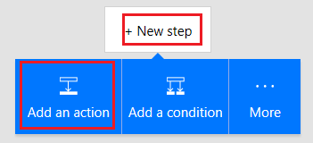
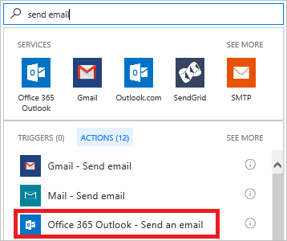
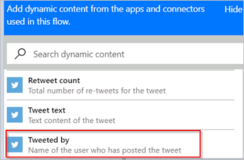
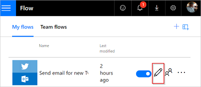
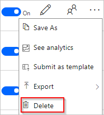

# Create a flow in Microsoft Flow

> [!VIDEO https://www.youtube.com/embed/Gt3CMhLAQqE?list=PL8nfc9haGeb55I9wL9QnWyHp3ctU2_ThF]

Create a flow that performs one or more tasks automatically after it's triggered by an event. For example, create a flow that notifies you by email when someone sends a tweet that contains a keyword you specify. In this example, sending a tweet is the event, and sending mail is the action.

## Prerequisites

* An account on [flow.microsoft.com](https://flow.microsoft.com)
* A Twitter account
* Office 365 credentials

## Specify an event to start the flow

First, you will need to select what event, or *trigger*, starts your flow.

1. In [flow.microsoft.com](https://flow.microsoft.com), select **My flows** in the top navigation bar, and then select **Create from blank**.

    
1. Select the **Search hundreds of connectors and triggers** box at the bottom of the screen, enter **Twitter** in the box that says **Search all connectors and triggers**, and then select **Twitter - When a new tweet is posted**.

    

1. If you haven't already connected your Twitter account to Microsoft Flow, select **Sign in to Twitter**, and then provide your credentials.

1. In the **Search text** box, type the keyword that you want to find.

    

## Specify an action

1. Select **New step**, and then select **Add an action**.

    

1. In the box that shows **Search all connectors and actions**, type or paste **send email**, and then select **Office 365 Outlook - Send an email**.

    

1. If prompted, select the sign-in button, and then provide your credentials.

1. In the form that appears, type or paste your email address in the **To** box then select your name from the list of contacts that appears.

    
1. In the **Subject** box, type or paste **New tweet from:**, then type a space.

    
1. In the list of tokens, select the **Tweeted by** token to add a placeholder for it.

    
1. Select the **Body** box, and then select the **Tweet text** token to add a placeholder for it.
1. (optional) Add more tokens, other content, or both to the body of the email.
1. Near the top of the screen, name your flow, and then select **Create flow**.

    
1. Select **Done** to update the list of flows.

     
1. Send a tweet with the keyword that you indicated, or wait for someone else to post such a tweet.

     Within a minute after the tweet is posted, an email message notifies you of the new tweet.

> [!TIP]
> Use the **Send email (V2)** action to format email in which you customize the font, use bold, italic or underline, customize the color and highlight, and create lists or links, and more.

## Manage a flow

1. In [flow.microsoft.com](https://flow.microsoft.com), select **My flows** in the top navigation bar.
1. In the list of flows, do any of the following:

   * To pause a flow, set its toggle to **Off**.

       
   * To resume a flow, set its toggle to **On**.

       
   * To edit a flow, select the pencil icon that corresponds to the flow you want to edit.

       
   * To delete a flow, select the **...** icon, select **Delete**, and then select **Delete** on the message box that appears.

       
   * To view the run history of a flow, select the flow from the **My flows** page, and then view the history under the **RUN HISTORY** section of the page that opens.

       

     Select a flow run from the list of runs to see the inputs and outputs of each step.

> [!NOTE]
> You can have up to 600 flows in your account. If you already have 600 flows, delete one before you create another flow.
>
>

## Next steps

* [Add steps](multi-step-logic-flow.md), such as different ways to be notified, to your flow.
* [Run tasks on a schedule](run-scheduled-tasks.md), when you want an action to occur daily, on a certain date, or after a certain number of minutes.
* [Add a flow to an app](https://powerapps.microsoft.com/tutorials/using-logic-flows/) to allow your app to kick off logic in the cloud.
* [Get started with team flows](create-team-flows.md) and invite others to collaborate with you to design flows.
