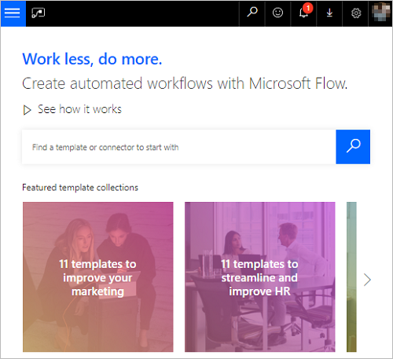
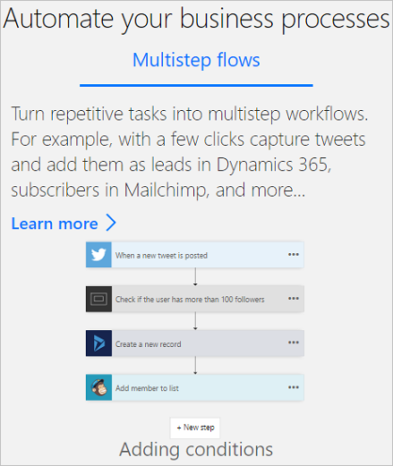
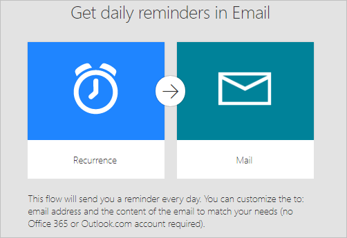

# Get started with Microsoft Flow #

<iframe width="560" height="315" src="https://www.youtube.com/embed/iMteXfAvDSE?list=PL8nfc9haGeb55I9wL9QnWyHp3ctU2_ThF" frameborder="0" allowfullscreen></iframe>

Welcome! Microsoft Flow is a service that helps you create automated workflows between your favorite apps and services to synchronize files, get notifications, collect data and more.

The main types of flows are [automated](get-started-logic-flow.md), [button](introduction-to-button-flows.md), [scheduled](run-scheduled-tasks.md), and [business process](business-process-flows-overview.md) flows.

If you are a Dynamics 365 customer engagement customizer, you may also be familiar with Classic Common Data Service processes which include, [workflows](configure-workflow-steps.md), [actions](create-actions.md), [mobile task flows](create-mobile-task-flow.md), and [dialogs](use-cds-for-apps-dialogs.md).

The first step is to [sign up](sign-up-sign-in.md), or, if you already have an account with Microsoft Flow, [sign in](https://flow.microsoft.com/signin) on your tablet, desktop computer, or even your phone.

## Check out the start page ##

[On the start page](https://flow.microsoft.com) for Microsoft Flow, you can [explore a diverse set of templates](https://flow.microsoft.com/templates) and learn about the key features for Microsoft Flow. You can get a quick sense of what's possible and how Microsoft Flow could help your business and your life.

With Microsoft Flow, you can:

- Easily search for templates and services.

    

- Choose from the most popular services.

    

- See an overview of each flow.

    

Each template is designed for a specific purpose. For example, there are templates for sending you a text message when your boss emails you, adding Twitter leads to Dynamics 365, or backing up your files. These templates are just the tip of the iceberg. They're intended to inspire you to create customized flows for the exact processes you need.

## Create your first flow ##

1. Select a template that's useful for you. A simple template is [**Get daily reminders in Email**](https://flow.microsoft.com/galleries/public/templates/45a3399aa29345308f08b6db0a9c85b9/):

    

1. Select **Continue**.

    

1. Enter the email addresses to which the daily reminder will be sent. Next, enter the reminder message. Finally, select **Create flow**, and then verify that your flow is running as expected.

    

    > [!NOTE]
    > You can explore the conditions that trigger the flow and the action that results from that event. Play around with the settings to make the flow your own. You can even add or delete actions.

1. Select **Done**.

[Follow this tutorial](get-started-logic-template.md) to learn more about creating flows from templates.

## Get creative ##

Now that you've created your first flow from a template, use any of the more than [150 data sources](https://flow.microsoft.com/connectors/) that Microsoft Flow supports to [create your own flows from scratch](get-started-logic-flow.md).

When you create a flow from scratch, you control the entire workflow. Here are a few ideas to get your started:

- [Flows with many steps](multi-step-logic-flow.md).
- [Run tasks on a schedule](run-scheduled-tasks.md).
- [Create an approval flow](wait-for-approvals.md).
- [Watch a flow in action](see-a-flow-run.md).
- [Publish a template](publish-a-template.md).
- [Create flows from a Microsoft Teams template](https://flow.microsoft.com/connectors/shared_teams/microsoft-teams/).

## Use the mobile app ##

Download the Microsoft Flow mobile app for [Android](https://aka.ms/flowmobiledocsandroid), [iOS](https://aka.ms/flowmobiledocsios), or [Windows Phone](https://aka.ms/flowmobilewindows). With this app, you can [monitor flow activity](mobile-monitor-activity.md), [manage your flows](mobile-manage-flows.md) and [create flows from templates](mobile-create-flow.md).

## We're here to help ##

We're excited to see what you do with Microsoft Flow, and we want to ensure you have a great experience. Be sure to check out our [guided learning](https://flow.microsoft.com/guided-learning/) tutorials and [join our community](http://go.microsoft.com/fwlink/?LinkID=787467) to ask questions and share your ideas. [Contact support](http://go.microsoft.com/fwlink/?LinkID=787479) if you run into any issues.
