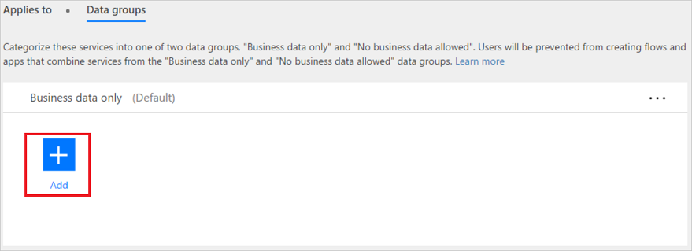
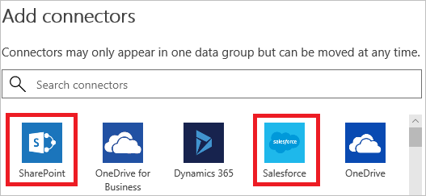

# Data loss prevention (DLP) policies
## What is a data loss prevention policy?
An organization's data is critical to its success. Its data needs to be readily available for decision-making but it needs to be protected so that it isn't shared with audiences that should not have access to it. To protect this data, Microsoft Flow (Flow) provides you with the ability to create and enforce policies that define which consumer services/connectors specific business data can be shared with. These policies that define how data can be shared are referred to as data loss prevention (DLP) policies.

## Why create a DLP policy?
You would create DLP policy to clearly define which consumer services business data may be shared with. For example, an organization that uses Flow may not want its business data that's stored in SharePoint to be automatically published to its Twitter feed. To prevent this, you can create a DLP policy that blocks SharePoint data from being used as the source for tweets.

## Benefits of a DLP policy
* Ensures that data is managed in a uniform manner across the organization  
* Prevents important business data from being accidentally published to services such as social media sites.   

## Managing DLP policies
**Prerequisites**  
In order to create, edit, or delete DLP policies, the following items are required: 

* Either environment admin or tenant admin permissions. You can learn more about permissions in the [environments topic](environments-overview-admin.md).  
* A [Flow P2 license](billing-questions.md).  

## Create a DLP policy
**Prerequisites**  
In order to create a DLP policy, you must have permissions to at least one environment.  

Follow these steps to create a DLP policy that prevents data that is stored in your company’s SharePoint from being published to Twitter:  

1. While on the Data Policies tab, select the **New policy** link:  
       
2. Enter the name of the DLP policy as *Secure Data Access for Contoso* in the **Data Policy Name** label at the top of the page that opens:   
     
3. Select the [environment](environments-overview-admin.md) on the **Applies to** tab.  
   **Note:** As an environment admin, you can create policies that apply to only a single environment. As a tenant admin, you can create a policy that applies to all environments, one or more selected environments, or all environments except a selected set:  
     
4. Select the **Data groups** tab:  
     
5. Select the **+ Add** link located inside the **Business data only** group box:    
     
6. Select the **SharePoint** and **Salesforce** services from the **Add services** page:  
     
7. Select the **Add services** button to add the services that are allowed to share business data:    
     
8. Select **Save Policy**:  
     
9. After a few moments, your new DLP policy will be displayed in the data loss prevention policies list:  
     
10. **Optional** Send an email or other communication to your team, alerting them that a new DLP policy is now available.

Congratulations, you have now created a DLP policy that allows app to share data between SharePoint and Saleforce and blocks the sharing of data with any other services.  

**Note**: Adding a service to one data group automatically removes it from the other data group. For example, if Twitter is currently located in the **business data only** data group, and you don't want to allow business data to be shared with Twitter, simply add the Twitter service to the **no business data allowed** data group. This will remove Twitter from the business data only data group.  

## Data sharing violations
Assuming you have created the DLP policy outlined above, if a user creates a flow that shares data between Salesforce (which is in the **business data only** data group) and Twitter (which is in the **no business data allowed** data group), the user will be informed that the flow is **suspended** due to a conflict with the data loss prevention policy you created.  
  

If your users contact you about suspended flows, here a few things to consider:  

1. In this example, if there is a valid business reason to share business data between SharePoint and Twitter, you can edit the the DLP policy.  
2. Ask the user to edit the flow to comply with the DLP policy.  
3. Ask the user to leave the flow in the suspended state until a decision is made regarding the sharing of data between these two entities.  

## Find a DLP policy
### Admins
Admins can use the search feature from the Admin center to find specific DLP policies.  

**NOTE** Admins should publish all DLP policies so that users in the organization are aware of the policies prior to creating flows.

### Makers
If you don't have admin permissions and you wish to learn more about the DLP policies in your organization, contact your administrator. You can also learn more from the [maker environments topic](environments-overview-maker.md)  

**NOTE** Only admins can edit or delete DLP policies.  

## Edit a DLP policy
1. Launch the Admin center by browsing to https://admin.flow.microsoft.com.  
2. In the Admin center that launches, select the **Data polices** link on the left side.  
     
3. Search the list of existing DLP policies and select the edit button next to the policy you intend to edit:  
     
4. Make the changes you wish to make. You can modify the environment or the services in the data groups, for example.  
5. Select **Save Policy** to save your changes:  
     

Your policy has now been updated. You can confirm that the changes have been made to your policy by finding it in the data loss prevention policies list and reviewing its properties.   

**Note** DLP policies created by tenant admins can be viewed by environment admins but cannot be edited by environment admins.  

## Delete a DLP policy
1. Launch the Admin center by browsing to https://admin.flow.microsoft.com.  
2. In the Admin center that launches, select the **Data polices** link on the left side.  
     
3. Search the list of existing DLP policies and select the delete button next to the policy you intend to delete:  
     
4. Confirm that you really want to delete the policy by selecting the **Delete** button:  
     

Your policy has now been deleted. You can confirm that the policy is no longer listed in the data loss prevention policies list by selecting the **Data Policies** link on the left and reviewing the list of policies.   

## DLP policy permissions
Only tenant and environment admins can create and modify DLP policies. Learn more about permissions in the [environments](environments-overview-admin.md) topic.  

## Next steps
* [Learn more about environments](environments-overview-admin.md)  
* [Learn more about Microsoft Flow](getting-started.md)  
* [Learn more about the admin center](admin-center-introduction.md)  

