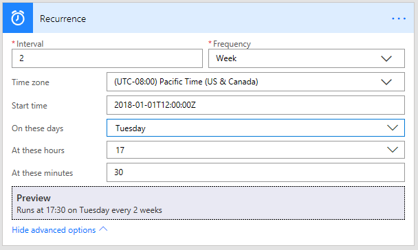

# Run flows on a schedule
Create a flow that performs one or more tasks (such as sending a report in email):

* once a day, an hour, or a minute
* on a date that you specify
* after a number of days, hours, or minutes that you specify

## Create a recurring flow
1. Sign in to [Microsoft Flow](https://flow.microsoft.com), and then select **My flows** in the top navigation bar.
   
    
2. Select **Create from blank**.
   
    
3. In the **Search all connectors and triggers** box, type **Recurrence**, and then select **Schedule - Recurrence**.
   
    
4. In the **Recurrence** dialog box, specify how often you want the flow to run.
   
    For example, specify **2** under **Interval** and **Week** under **Frequency** if you want the flow to run every two weeks.
   
    

## Specify advanced options
1. Follow the steps in the previous section, and then select **Show advanced options**.
   
    **Note**: These options change based on the values to which **Interval** and **Frequency** are set. If your screen doesn't match the graphic below, make sure that **Interval** and **Frequency** are set to the same values that the graphic shows.
2. Select a **Time zone** to specify whether the **Start time** reflects a local time zone, Universal Coordinated Time (UTC), etc.
3. Specify a **Start time** in this format:
    YYYY-MM-DDTHH:MM:SSZ
4. If you specified **Day** under **Frequency**, specify the time of day when the flow should run.
5. If you specified **Week** under **Frequency**, specify the day or days of the week on which the flow should run and the time or times of day when the flow should run.
   
    For example, configure the options as shown to start a flow no sooner than noon (Pacific time) on Monday, January 1, 2018, and run it every two weeks on Tuesdays at 5:30p (Pacific time).
   
    
6. Add the action or actions that you want the flow to take, as [Create a flow from scratch](get-started-logic-flow.md) describes.

## Delay a flow
1. Sign in to [Microsoft Flow](https://flow.microsoft.com), and then select **My flows** in the top navigation bar.
   
    
2. Select **Create from blank**.
   
    
3. Specify an event as [Create a flow from scratch](get-started-logic-flow.md) describes.
4. Select **New step**, and then select **Add an action**.
   
    
5. In the list of actions, do either of the following:
   
   * Select **Delay**, specify a **Count**, and specify a **Unit** of time such as second, minute, or hour.
   * Select **Delay until**, and then specify a date in this format. YYYY-MM-DDTHH:MM:SSZ
     
     
     
     

