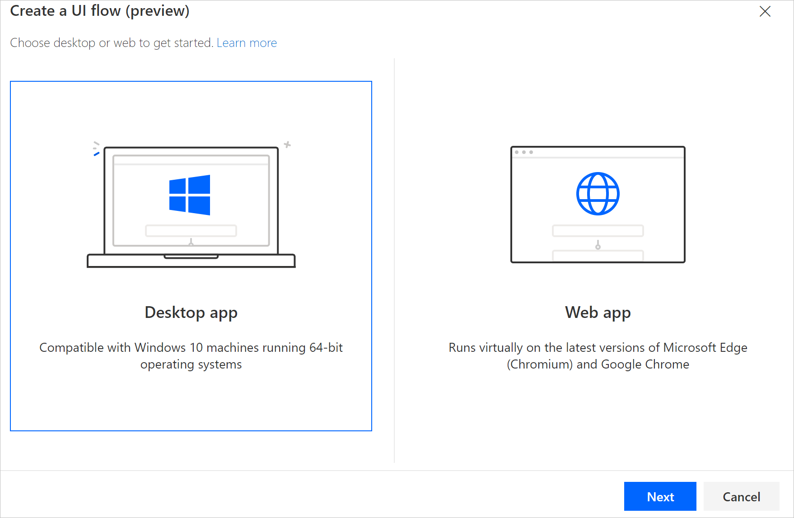
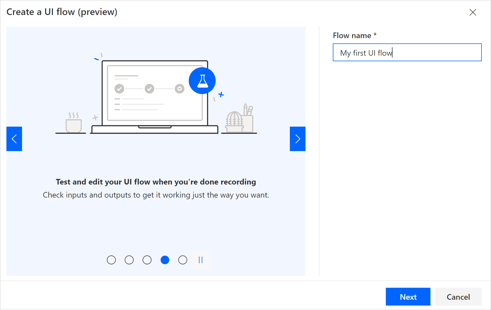
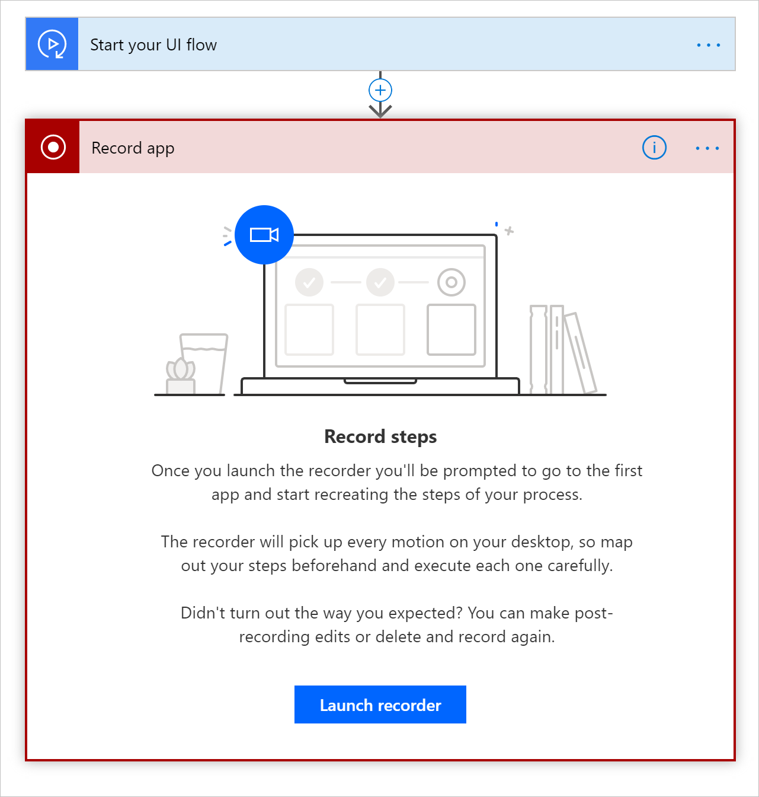

# Create and test desktop UI flows
[!INCLUDE [view-pending-approvals](../includes/cc-rebrand.md)]

[This topic is pre-release documentation and is subject to change.]

In the following steps, we'll demonstrate how to automate the calculator app to sum two numbers and then store the result for later use. 

>[!TIP]
>You can automate other apps by following a similar pattern.

## Create a desktop UI flow

1. Ensure your [device is ready]() to create UI flows. <!--Todo: link to the prereqs section-->
1. Use the [Chromium version of Microsoft Edge](https://www.microsoftedgeinsider.com) or Google Chrome to open [Microsoft Flow](https://flow.microsoft.com), and then sign in with a work or school email account.

1. Select  **My flows** > **UI flows (preview)** > **New**.

   

1. Choose **Desktop app** and then select **Next**.

    

1. Enter a name for your UI flow into the **Flow name** field, and then select **Next**.

    

1. Select **Next** at the bottom to skip the optional **Set up inputs** screen since we aren't using inputs in this walkthrough.

1. Select the **Record app** card to expand it.

   

1. Select **Launch recorder**.

   

   The recorder control displays at the top of your screen.

   

1. Start the calculator app.

     >[!TIP]
     >As your mouse hovers over controls in the app, you'll notice that a blue outline highlights each control. Always wait for the blue highlight before you select a control.
     >
     >If the blue highlight doesn't display around the element, it might not be recorded properly.

1. Select **Record** from the recorder control.
1. Select the first number, select **+**, select the second number, and then select **=**.

    

     <!--todo Is this really necessary?-->
     >[!NOTE] 
     >Unsupported apps will be blocked so that you don’t unintentionally record them.

1. Select **Done** on the recorder control after you complete the actions you want to record.

1. Close the app that you recorded.

1. Select the card that starts with "Run <app name> script" to view  screenshots of the recorded steps.

     >[!TIP]
     >Select **...** > **Delete** to remove any extra steps that you may want to remove.

    

1. Select **Next**. 

1. Select **Next** to skip the optional **Set up outputs** step since we aren't using outputs in this walkthrough.

## Test your UI flow

It's always a great idea to test your UI flow. To do this, select the **Test now** button, and then watch your UI flow run.
    
 >[!IMPORTANT]
 >For best results, do not interact with your device for the duration of playback.

1. Select **Save and exit** to save your flow and exit the UI flows feature.

## Known issues and solutions

- Open and maximize the apps your want to record before *before* you start recording.

- Add a **Close** action at the end of your UI flow because UI flows launches a new instance of the applications with each test or run.

- Select **...** > **Delete** on the recorded actions card to remove any unnecessary/duplicate actions. Duplicate actions may be created depending on the type and the speed of you are recording. 

- Right clicks may not play back correctly. In such case, while recording, click left to focus UI flows on the target user interface element, and then right click.

<!--Todo: link to uninstall instructions-->
If UI flows no longer records or plays back Windows applications after installing a new version, uninstall the previous version and then install a new version.

### Unsupported application types

-   Interactions on Windows (File explorer, startup menu, task bar, etc.).

-   Web browsers (Chrome, IE, Edge, Edge Chromium, Firefox, Mozilla, etc.).
    Please instead refer to [Create a Web UI flow](edit-web.md) to
    automate websites.

-   Java applications.

-   Click once applications.

-   Applications with a Web view such as Electron applications.

-   Office 2016 and earlier.

### Unsupported configurations

-   Multi-screen.

-   Recording through a virtual machine client (Remote Desktop, Citrix, etc.),
    either with the UI flows app running on the host device or on the virtual
    machine. None are supported.

-   Moving an application to another screen during a recording session.

-   Multiple instances of an application where the main window titles are
    identical.

-   Application windows with identical titles, for example, Microsoft Outlook with multiple **Untitled – Message (HTML)** new mail windows active at the same time.

-   Applications that span multiple monitors.

-   Concurrent recording sessions on a given device.

-   Concurrent playback sessions on a given device. In case of simultaneous UI
    flow runs, the first one takes precedence and the subsequent ones 
    fail until the first one  completes.

-   Playback on a device with a different keyboard layout than the device on which it was recorded.

-   Recording on a device or Windows session while the browser with Microsoft
    Flow is on a different device or Windows session.

### Unsupported action types and behaviors

The following actions will not be recorded:

-   Double click.

-   Mouse move.

-   Mouse hover.

-   Click and drag.

-   Touch or pen input.

-   Open app before recording.

-   Closed app before playback starts.

## Next steps

<!--Todo: fix links-->
- Learn how to trigger the UI flow you just created [run UI flows](run-ui-flow.md).

- If you want to do more with UI flows, you can also try out UI flows with [input and output](inputs-outputs-web.md) parameters.

