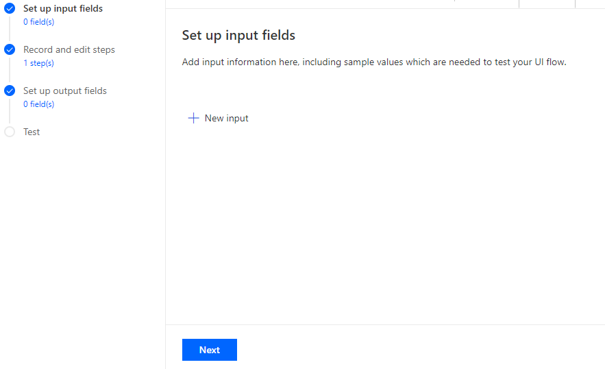
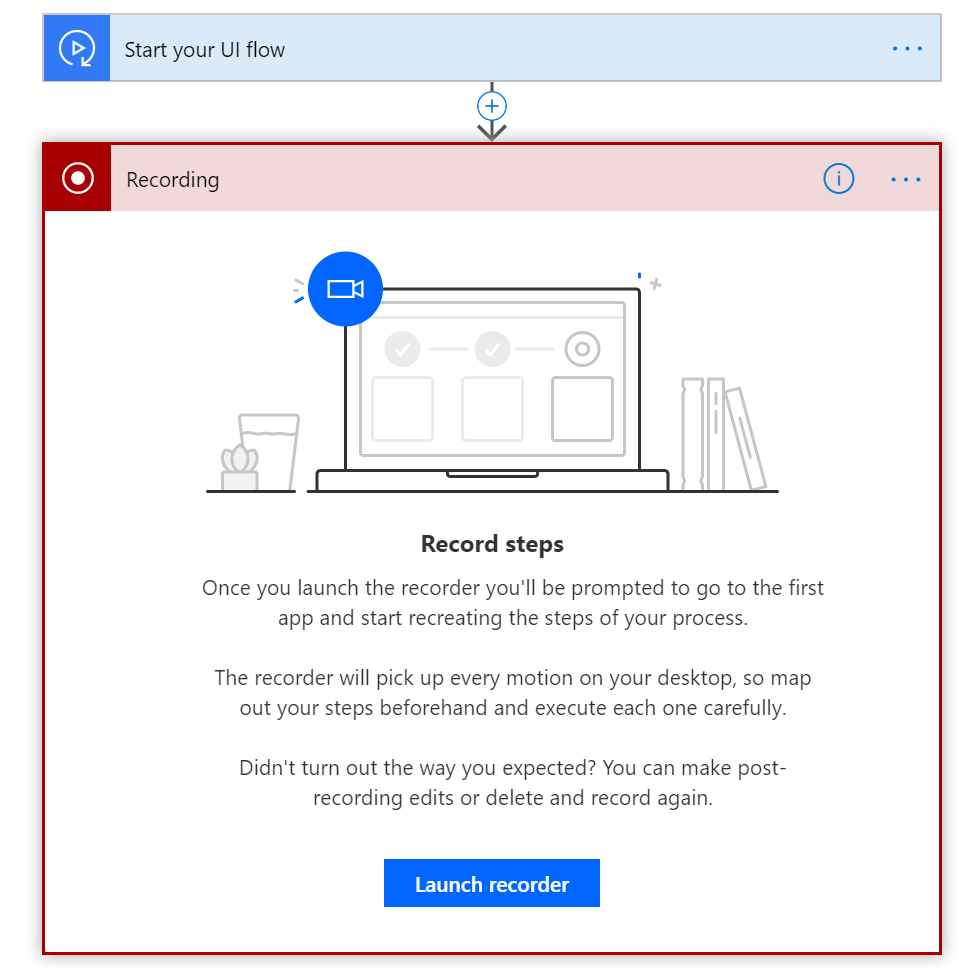
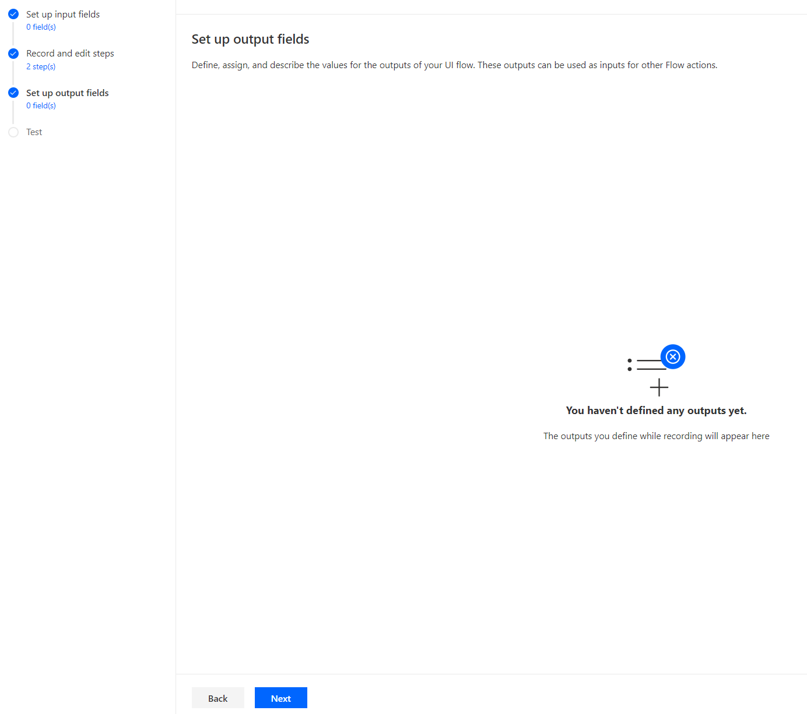

# Create and test desktop UI flows

[This topic is pre-release documentation and is subject to change.]

In the following steps, we'll demonstrate how to automate the calculator app to add two numbers and then store the result for later use. You can automate other apps by following a similar pattern.

1. Ensure your [device is ready]() to create UI flows. <!--Todo: link to the prereqs section-->
1.  Use the [Chromium version of Microsoft Edge](https://www.microsoftedgeinsider.com) or Google Chrome to open [Microsoft Flow](https://flow.microsoft.com), and then sign in.

1. Select  **My flows**, and then select **UI flows (preview)**.
1. Select **+ New** from the top of the screen.    

   

1.  Choose **Desktop app** and then select **Next**.

     

1.  Enter a name for your UI flow into the **Flow name** field, and then select **Next**.

1.  Select **Next** at the bottom to skip the optional **Set up inputs** screen.

    

1.  Select the **Record app** card to expand it.

     

1.  Select **Launch recorder**.

    

    The recorder control displays at the top of your screen.

1.  Start the calculator app.

     >[!TIP]
     >As your mouse hovers over controls in the app, you'll notice that a blue outline highlights each control. Always wait for the blue highlight before you select a control.
     >
     >If the blue highlight doesn't display around the element, it might not be
    recorded properly.

1.  Select **Record** from the recorder control.
1.  Select the first number, select **+**, select the second number, and then select **=**.

     <!--todo Is this really necessary?-->
     >[!NOTE] 
     >Unsupported apps will be blocked so that you don’t unintentionally record them.

    

1.  Select **Done** after you complete the actions you want to record, and then close the app that you recorded.

    

1.  Select the card that starts with "Run <app name> script" to view the screenshot list of recorded steps.

     >[!TIP]
     >Select **...** > **Delete** to remove any extra steps that you may want to remove. 
1.  Select **Next**. 

    

1.  Select **Next** to skip the optional **Set up outputs** step.

    

    >[!TIP]
    >It's always a great idea to test your UI flow. To do this, select the **Test now** button, and then watch your UI flow run.
    
    >[!IMPORTANT]
    >For best results, do not interact with your device for the duration of playback.

1.  Select **Save and exit** to save your flow and exit the UI flows feature.

## Known issues in the Preview release of desktop UI flows

[This topic is pre-release documentation and is subject to change.]

It is recommended to have the apps that you want to record already launched and in a maximized state before you start recording.

UI flows will launch a new instance of the applications upon each test or run. It is recommended to add a **Close** action at the end of your UI flow.

Duplicate actions may be created depending on the type of application and the speed of your recording. You can review and delete actions by selecting “**…**”.

Right clicks may not played back correctly. In such case, while recording, click left to focus UI flows on the target User Interface element then right click.

<!--Todo: link to uninstall instructions-->
If UI flows no longer records or plays back Windows applications after installing a new version, uninstall the previous version before installing a new one.

## Unsupported application types

-   Interactions on Windows (File explorer, startup menu, task bar, etc.).

-   Web browsers (Chrome, IE, Edge, Edge Chromium, Firefox, Mozilla, etc.).
    Please instead refer to [Create a Web UI flow](edit-web.md) to
    automate websites.

-   Java applications

-   Click once applications

-   Applications with a web view such as Electron applications

-   Office 2016 and earlier

## Unsupported configurations

-   Multi-screen

-   Recording through a virtual machine client (Remote Desktop, Citrix, etc.),
    either with the UI flow app running on the host device or on the virtual
    machine. None are supported.

-   Moving an application to another screen during a recording session.

-   Multiple instances of an application where the main window titles are
    identical.

-   Application windows with identical titles – e.g. for Microsoft Outlook:
    multiple “Untitled – Message (HTML)” new mail windows active at the same
    time.

-   Applications that span across multiple monitors.

-   Concurrent recording sessions on a given device.

-   Concurrent playback sessions on a given device. In case of simultaneous UI
    flow run, the first one will take precedence and the subsequent ones fill
    fail until the first one is completed.

-   Playback on a machine with different keyboard layout than the one it was
    initially recorded on.

-   Recording on a device or Windows session while the Browser with Microsoft
    Flow is on a different device or Windows session.

## Unsupported action types & behaviors (will not be recorded)

-   Double click

-   Mouse move

-   Mouse hover

-   Click and drag

-   Touch or pen input

-   Open app before recording

-   Closed app before playback starts

## Next steps

<!--Todo: fix links-->
- To trigger the UI Flow you just created you can learn how to [run UI
flows](run-ui-flow.md).

- If you want to do more with UI flows, you can also try out UI flows with [input and output](inputs-outputs-web.md) parameters.

