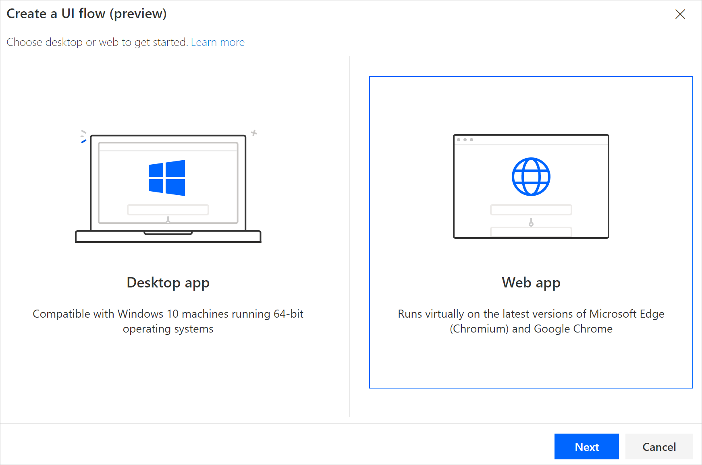
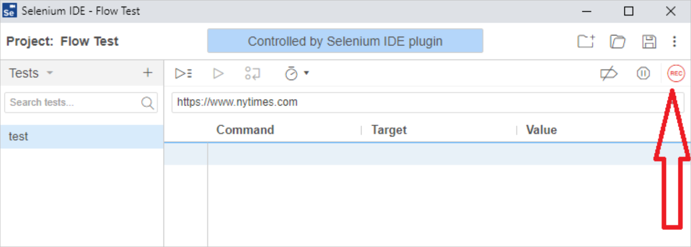

# Create and test your Web UI flows

[This topic is pre-release documentation and is subject to change.]

[!INCLUDE [view-pending-approvals](../includes/cc-rebrand.md)]

Follow these steps to create a simple Web UI flow:

## Create a Web UI flow

1. Open the [next version of Microsoft
   Edge](https://www.microsoftedgeinsider.com/) or Google Chrome, and then navigate to [Microsoft Flow](https://flow.microsoft.com/).

1. Sign in with your work or school account if needed.

1. Select  **My flows** > **UI flows (preview)** > **New**.

   

1. Select **Web app**  > **Next**
    
   

1. Enter a name for your UI flow into the **Flow name** field.

1. Enter the URL for the Website you want to automate into the **Base URL** field, and then select **Launch recorder**.

    

   The Selenium IDE launches.

   >[!TIP] 
   >Tip: You can record actions across multiple HTTP or HTTPS websites within
    the same tab.  

1. In Selenium IDE, select the red **REC** button in the top right side of the screen to launch the recorder.

   The the URL you chose in the previous step opens.

   

1.  Perform the actions that you want to record on the website. 
    
    >[!TIP]
    >At the bottom right, you can see the recording status.

    

1.  When you are finished recording, select on the red **Stop** button in the top right corner of the Selenium IDE.

    

1. Select the **Run current test** button from the top left side of the screen to see the UI flow you just created run.

    

   >[!TIP]
   >You can set the wait time between steps to slow the local playback for testing. This setting is for testing purposes only and has no impact when your UI flow is deployed.  
  
1. Select the **Save project** button in the top right of the Selenium IDE. This closes, and then uploads the project.

Now that you've created a Web UI flow, use it in your other flows.

## Limitations and known issues for Web UI flows

>[!WARNING]
>**Passwords in Selenium IDE are stored in plain text.**  

**UI flows no longer records or plays back Windows applications after installing a new version.**

You need to uninstall the previous version before installing a new one.

For that, open the Start menu, go to “Settings”, then “Apps & features”, search for “RPA” in the list of apps, select "Microsoft Flow RPA" and click "Uninstall". The uninstaller wizard will guide you through the uninstallation.

**Temporary user profile for playback**

Selenium IDE recordings are done with current user's profile, but playback is done using a temporary user profile. This means that websites that need authentication may not ask for credentials during a recording session, but the authentication steps will be needed during playback. 

To address this, the user needs to manually edit the script to insert the commands needed for the login process.

**Other limitations**

-   Recording desktop applications during a Web recording session . If you need to automate both Web and Desktop applications, you can create two separate UI flows for each type and combine them in a flow.

-   Multi-Factor Authentication (MFA) is not supported, please use a tenant that doesn't require MFA.

-   These Selenium IDE commands are not supported: Run, AnswerOnNextPrompt, ChooseCancelOnNextConfirmation, ChooseCancelOnNextPrompt, ChooseOkOnNextConfirmation, Debugger, ClickAt, DoubleClickAt, Echo, MouseOut, MouseUpAt, and MouseDownAt.

-   Right click is not supported. 

-   Additional Web UI flow input is generated when you use Foreach commands.
    To workaround this issue, input any value into the extra fields. It doesn't impact the playback.

-   If the .side file contains multiple test projects, only the first one that was created is runs. 

     >[!TIP]
     >Note that Selenium IDE orders the tests by name, not by creation date, so the first created may not be the first one in the list.

-   Playback directly in the Selenium IDE might not behave as intended. However, playback at runtime through the UI flow infrastructure behaves correctly.

## Next steps

<!--Todo: fix links-->
- Learn how to [run UI flows](run-ui-flow.md).

- If you want to do more with UI flows, you can also try out UI flows with [input and output](inputs-outputs-web.md) parameters.

