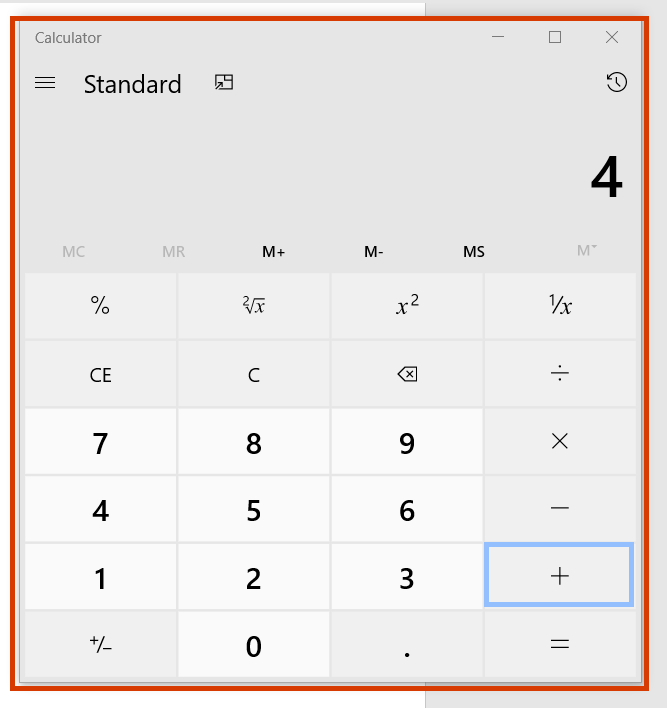
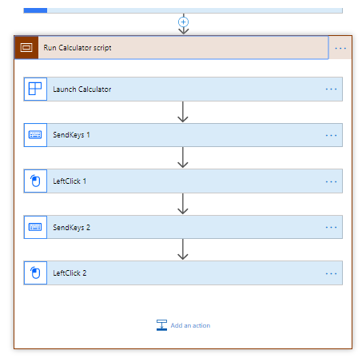

# Create your first desktop UI flow

In the following steps, we'll demonstrate how to automate the calculator app to add two numbers and then store the result for later use. You can automate other apps by following a similar pattern.

1. Ensure your [device is ready]() to create UI flows. <!--Todo: link to the prereqs section-->
1.  Use the [Chromium version of Microsoft Edge](https://www.microsoftedgeinsider.com) or Google Chrome to open [Microsoft Flow](https://flow.microsoft.com), and then sign in.

1. Select  **My flows**, and then select **UI flows (preview)**.
1. Select **+ New** from the top of the screen.    

   

1.  Choose **Desktop app** and then select **Next**.

     

1.  Enter a name for your UI flow into the **Flow name** field, and then select **Next**.

1.  Select **Next** at the bottom to skip the optional **Set up inputs** screen.

    

1.  Select the **Record app** card to expand it.

     

1.  Select **Launch recorder**.

    

    The recorder control displays at the top of your screen.

1.  Start the calculator app.

     >[!TIP]
     >As your mouse hovers over controls in the app, you'll notice that a blue outline highlights each control. Always wait for the blue highlight before you select a control.
     >
     >If the blue highlight doesn't display around the element, it might not be
    recorded properly.

1.  Select **Record** from the recorder control.
1.  Select the first number, select **+**, select the second number, and then select **=**.

     <!--todo Is this really necessary?-->
     >[!NOTE] 
     >Unsupported apps will be blocked so that you don’t unintentionally record them.

    

1.  Select **Done** after you complete the actions you want to record, and then close the app that you recorded.

    

1.  Select the card that starts with "Run <app name> script" to view the screenshot list of recorded steps.

     >[!TIP]
     >Select **...** > **Delete** to remove any extra steps that you may want to remove. 
1.  Select **Next**. 

    

1.  Select **Next** to skip the optional **Set up outputs** step.

    

    >[!TIP]
    >It's always a great idea to test your UI flow. To do this, select the **Test now** button, and then watch your UI flow run.
    
    >[!IMPORTANT]
    >For best results, do not interact with your device for the duration of playback.

1.  Select **Save and exit** to save your flow and exit the UI flows feature.

## Next steps

