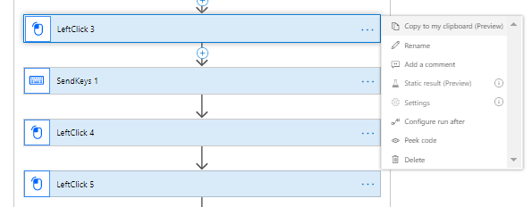
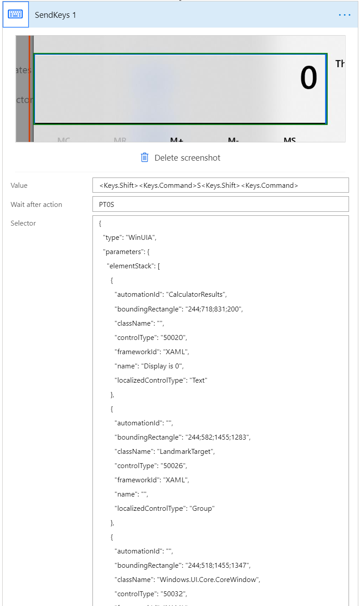
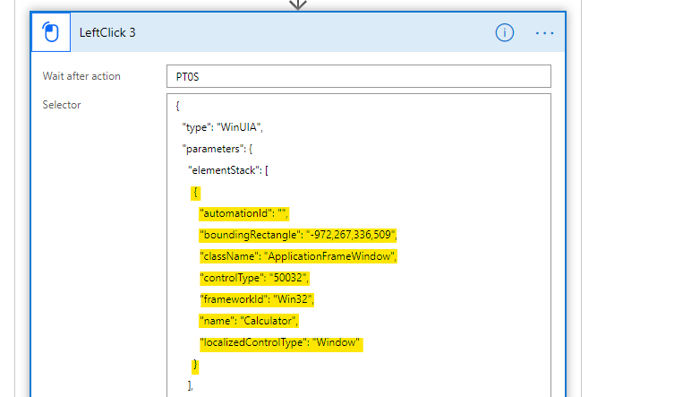

# Edit desktop UI flows
[!INCLUDE [view-pending-approvals](../includes/cc-rebrand.md)]

[This topic is pre-release documentation and is subject to change.]

Desktop UI flows automate Windows desktop applications. Please refer to the [Known issues](create-desktop.md#known-issues-and-solutions) to learn more about issues you might run into, workarounds for those issues, and scenarios that are not supported in this preview release.

## Prerequisites
A desktop UI flow. [Create a desktop UI flow now](create-desktop.md#create-and-test-desktop-ui-flows) if you don't have one to edit.

## Edit actions



You can edit your recording to:

-   Modify the value for actions that support it.
-   Delete a step.
-   Delete the entire recording.
-   Change the order of actions with drag and drop. Do exercise caution with this
    as it may break the consistency of your recording.

Advanced parameters let you change:

-  The delay after the action is performed. For example, you can add a one second delay by changing PT0S to PT1S. This can be useful when the target application has a slow response time that doesn't  complete before the next step of your UI flow.
-   The [selector](edit-desktop.md#set-the-selector) for the target user interface element.

## Add a recording

You may want to record your UI flow in multiple sessions. After you've completed your first recording you can proceed as follows:

1. Select either **+** or **New step**.

   

1. Select **Record UI actions** from the list of actions.

   

   A new recording card is added to your UI flow. 

1. Start a new recording from this action card. 

## Add a manual action

Once you've recorded an application with at least one action, you can manually add
any of the following actions for that application.

| **Action**          | **Comment**                                                       |
|---------------------|-------------------------------------------------------------------|
| Close application   |                                                                   |
| Right click         |                                                                   |
| Send keys           | Send keys and key combinations, such as CTRL + C.                             |
| Left click          |                                                                   |
| Get text            | Read the text from a user interface element and then use it as an output. |
| Enter text          |                                                                   |
| Get element enabled | Check if a user interface element is enabled or disabled.         |
| Clear element       | Clear the value in an editable user interface element.             |
| Wait for seconds    | Wait before continuing to the next step.                           |

Once the action is added, you will need to set the **Selector** in the action’s
advanced parameters.

### Set the selector

The selector identifies the user interface element onto which the action is performed during playback. We recommend that you copy/paste this information from a separate step targeting the same user interface element, if possible.



The format of the selector is:

```json
{  
   "type":"WinUIA",
   "parameters":{  
      "elementStack":[  

      ],
      "elementXPath":""
   }
}
```

You need to provide the data for the the **elemementStack** and **elementXPath** fields.



<!--todo-->
<!-- **CAP only** -->

You can capture the elementXPath using the [WinAppDriver UI
Recorder](https://blogs.windows.com/windowsdeveloper/2018/06/20/introducing-winappdriver-ui-recorder/.


Remove the first element (everything before /Window) before using the result in the selector elementXPath.

Test your UI flow to confirm that your selector works correctly.


