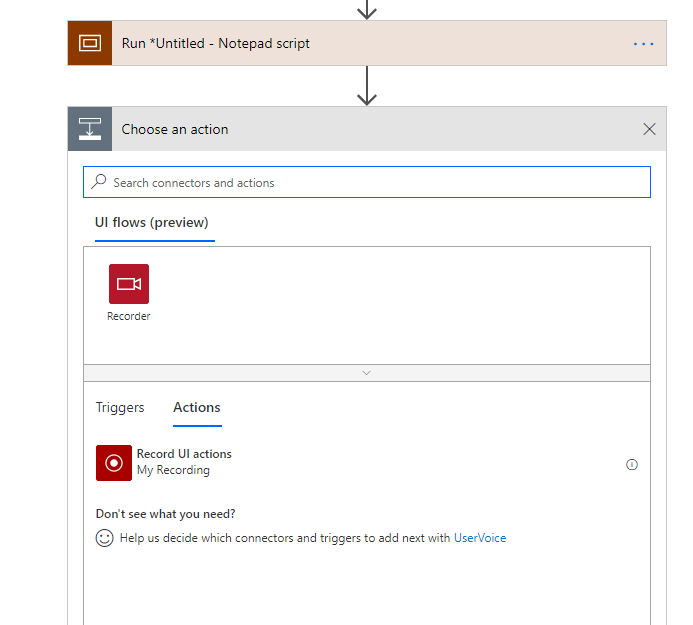

# Edit desktop UI flows
[!INCLUDE [view-pending-approvals](../includes/cc-rebrand.md)]

[This topic is pre-release documentation and is subject to change.]

Desktop UI flows automate Windows applications. Please refer to the [Known issues](known-issues-desktop.md) to learn more about which types of applications are currently unsupported.

## Edit actions

You can edit your record to:

-   modify the value for actions that support it

-   delete a step from the recording

-   delete the entire recording

-   change the order of actions with drag and drop (exercise caution with this
    as it may break the consistency of your recording)

Advanced parameters let you change:

-   The delay after the action is performed. E.g.: change PT0S into PT1S to add
    1 second delay. This can be useful when the target application has a slow
    response time that not complete before the next step of your UI flow.

-   The Selector for the target User Interface element. See below for more
    information.

## Add a Recording

You may want to record your UI flow in multiple sessions. In such case after a
first recording you can proceed as follows:

1.  Select either the “**+**” button or the “**+ New step**” button

1.  Select “Record UI actions” in the list of actions

1.  A new recording card is added to your UI flow. You can now start a new
    recording from this action card (see Launch a record documentation)

## Add a Manual action

Once you recorded an application with at least an action, you can manually add
any of the following actions for that application.

| **Action**          | **Comment**                                                       |
|---------------------|-------------------------------------------------------------------|
| Close application   |                                                                   |
| Right click         |                                                                   |
| Send keys           | Send keys and combos such as CTRL + C                             |
| Left click          |                                                                   |
| Get text            | Read the text from a User Interface element and use as an output. |
| Enter text          |                                                                   |
| Get element enabled | Check if a User Interface element is enabled or disabled.         |
| Clear element       | Clear the value in an editable User Interface element             |
| Wait for seconds    | Wait before continuing to the next step                           |

Once the action is added, you will need to set the **Selector** in the action’s
advanced parameters.

The Selector identifies the User Interface element onto which the action is
performed during playback . It is recommended to copy/paste this information
from a separate step targeting the same User Interface element.

The format of the Selector is:

{

“type”: “WinUIA”,

“parameters”: {

“elementStack”: [],

“elementXPath”: “”

}

You need to fill the elemementStack and elementXPath fields.

**CAP only**

You can capture the ementXPath using the [WinAppDriver UI
Recorder](https://blogs.windows.com/windowsdeveloper/2018/06/20/introducing-winappdriver-ui-recorder/).

Remove the first element (everything before /Window) before using the result in
the Selector elementXPath.

Test your UI flow to make sure that your Selector works correctly.

