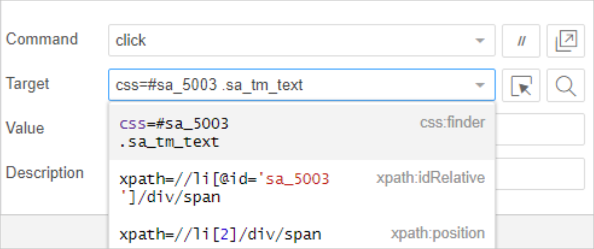

# Edit Web UI flows
[!INCLUDE [view-pending-approvals](../includes/cc-rebrand.md)]

[This topic is pre-release documentation and is subject to change.]

Web UI flows automate websites running in the [next version of Microsoft
Edge](https://www.microsoftedgeinsider.com/) or Google Chrome

## Record your actions on the Web

Recording is documented in the [quick start for creating Web UI flows](create-web.md).

## Edit in Selenium IDE

Edition is done in Selenium IDE. Edition in Selenium IDE is aimed at advanced users and developers.

You can refer to the [Selenium Commands](https://www.seleniumhq.org/selenium-ide/docs/en/api/commands/) to edit the script.

Selenium IDE will suggest different selectors and a default one when targeting a User Interface element. You can also define a new selector if none of the proposed selectors are appropriate. This usually happens when the website’s HTML structure is highly dynamic.

Below is an example of possible selectors that Selenium IDE identified:

## Accessing a property of an object variable or item of an array variable**

This advanced capability lets you use syntax like \${foo.bar} to access the bar property of the foo object. You can also write to the bar property of foo by using foo.bar as the value property in a store commands. You can also use syntax such as \${foo[0]} to access the item in specific index of foo array.

## Next steps

