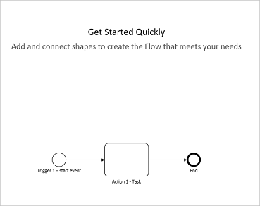

# Design flows in Microsoft Visio
[!INCLUDE [view-pending-approvals](includes/cc-rebrand.md)]

The Microsoft Flow designer is a rich tool in which you can configure every detail of your logic. However, sometimes you may want to just sketch your flow logic before you start building your flow. To do this, use Microsoft Visio directly from within Microsoft Flow.

>[!TIP]
> Many processes share a common model but have minor variations throughout an organization. You can save time within your organization by using Visio to create a master workflow model that others will then adjust with specialized parameters.

## Prerequisites

- A Microsoft Flow account.
- The Microsoft Visio desktop app (English version).
- Expertise in using Microsoft Visio.

## Design a workflow in Visio

1. Sign into [Microsoft Flow](https://flow.microsoft.com).
1. Select **Templates** from the left side panel.

     

1. Select **Visio** from the list.

      

1. Select the **Basic Flow BPMN Diagram** template from the list of **Visio** templates that displays.

      

     >[!IMPORTANT]
     >Visio warns you that files from the Internet could harm your device. If you are comfortable, select **YES** on the warning message.

     

1. The Visio designer launches.

     

1. Use the BPMN basic shapes to [design your workflow](https://support.office.com/article/design-a-microsoft-flow-in-visio-35f0c9a9-912b-486d-88f7-4fc68013ad1a).

   

## Prepare to export your workflow to Microsoft Flow

Follow these steps to prepare your workflow so that you can export it to Microsoft Flow.

1. Select the **Process** tab.
1. Select **Prepare to Export** from the **Microsoft Flow** group of icons.

   
   
   The **Prepare to Export** group opens.

   

1. On the **Flow Mapping** tab of the **Prepare to Export** group, map your BPMN diagram to Microsoft Flow controls. 

1. On the **Triggers and Actions** tab of the **Prepare to Export** group, map your BPMN diagram to Microsoft Flow triggers and actions by selecting each shape and then selecting either a trigger or action to represent that shape in Microsoft Flow.

Your workflow is ready to be exported when there are no issues remaining on the **Prepare to Export** control.

 

## Export your workflow
1. Select the **Export to Flow** button to export your workflow diagram to Microsoft Flow.
1. Name your flow and then select the **Create flow** button.
   
   

1. You should see a success report similar to this one.

    

You can now run or make edits to your flow from the Microsoft Flow designer, just like any other flow.

>[!TIP]
> Use Visio’s sharing and commenting capabilities to collaborate with multiple stakeholders and create a complete workflow quickly.

## Learn more

- [Get started with Microsoft Flow](getting-started.md) 
- [Build multi-step flows](multi-step-logic-flow.md)
- [Design a flow with Microsoft Visio](https://support.office.com/article/design-a-microsoft-flow-in-visio-35f0c9a9-912b-486d-88f7-4fc68013ad1a)

     
